# Basic Usage for **Animes Stock**

## Route <code>/animes</code>

### Method **POST**

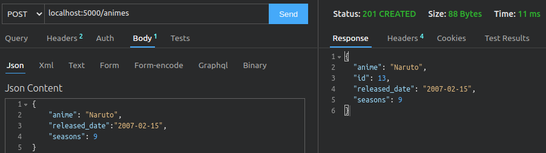

Example of POST requisition

 

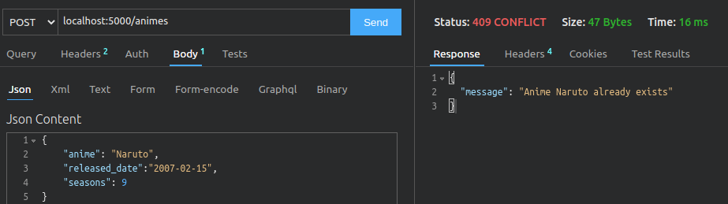

Example of POST requisition with existent anime

 

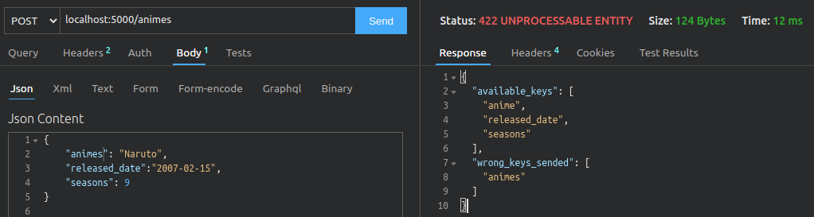

Example of POST requisition with invalid keys

 

## Route <code>/animes</code>

### Method **GET**

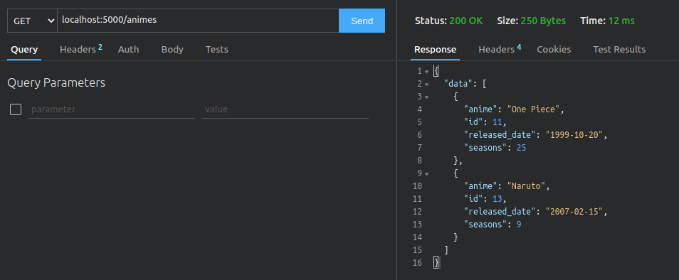

Example of GET requisition with data

 

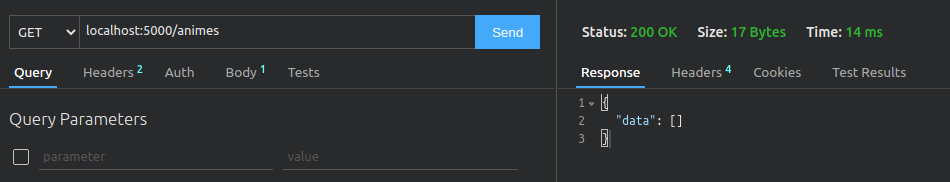

Example of GET requisition with no data

 

## Route <code>`/animes/<int:anime_id>`</code>

### Method **GET**

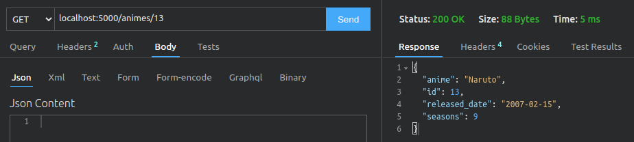

Example of GET by id requisition with data

 

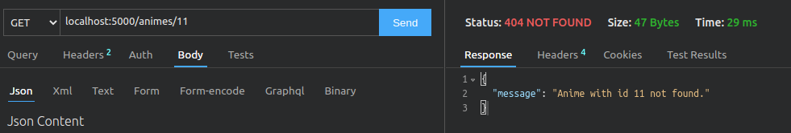

Example of GET by id requisition not found

 

## Route <code>`/animes/<int:anime_id>`</code>

### Method **PATCH**

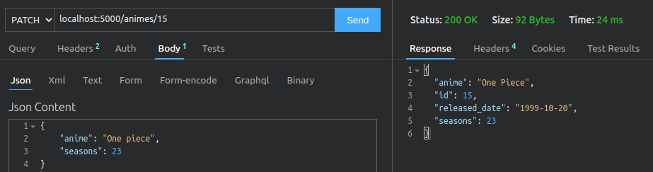

Example of PATCH requisition success

 

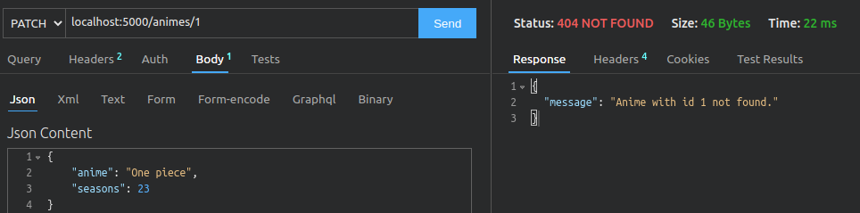

Example of PATCH requisition not found

 

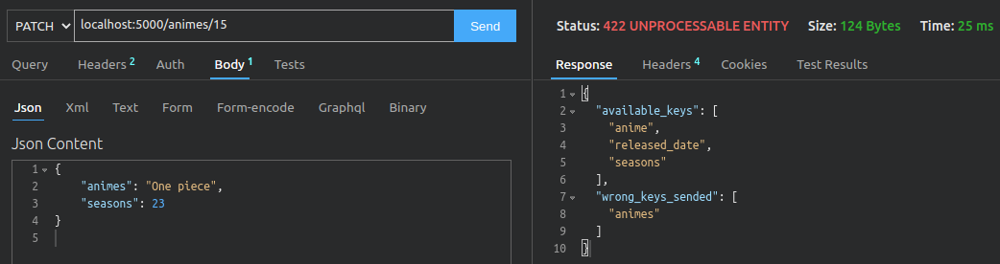

Example of PATCH requisition with invalid keys sended

 

## Route <code>`/animes/<int:anime_id>`</code>

### Method **DELETE**

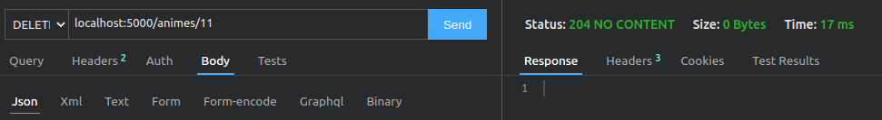

Example of DELETE requisition success

 

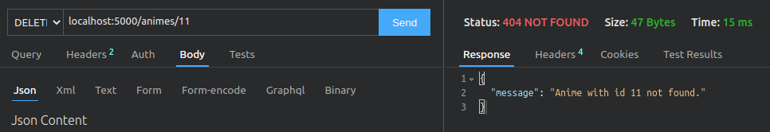

Example of DELETE requisition not found

 
